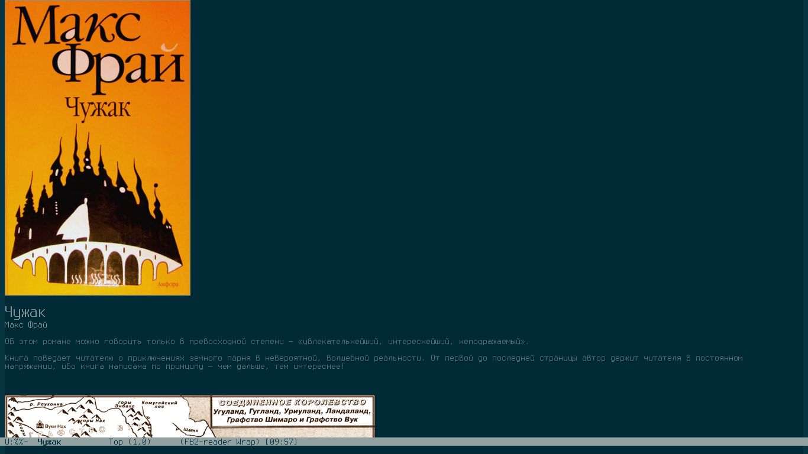

fb2-mode
========
FictionBook2 reader for emacs.



Installation
------------
Add to your .emacs file:
```elisp
(add-to-list 'load-path "path-to-fb2-mode-dir")
(require 'fb2-mode)
```

Configure
---------

* fb2-show-images — if not nil then images in book will displayed (default t).
* fb2-images-height — height of images in fb2-mode buffer (default 500).
* fb2-replace-hard-spaces — if not nil then non-breaking spaces will replaced by spaces (default nil).